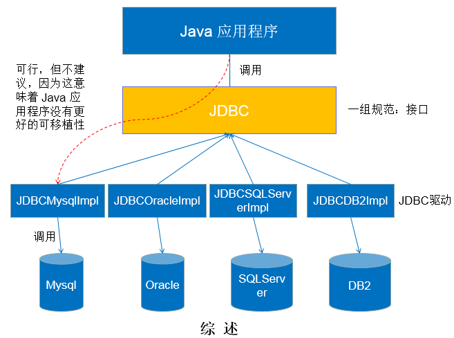
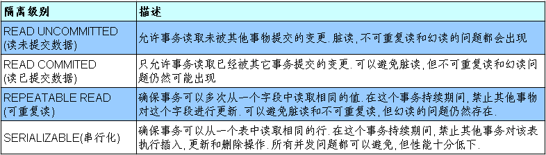

[toc]

# JDBC概述

- JDBC(Java Database Connectivity)是一个**独立于特定数据库管理系统、通用的SQL数据库存取和操作的公共接口**
  （一组API），定义了用来访问数据库的标准Java类库，（**java.sql,javax.sql**）使用这些类库可以以一种**标准**的方法、方便地访问数据库资源。
- JDBC为访问不同的数据库提供了一种**统一的途径**，为开发者屏蔽了一些细节问题。
- JDBC的目标是使Java程序员使用JDBC可以连接任何**提供了JDBC驱动程序**的数据库系统，这样就使得程序员无需对特定的数据库系统的特点有过多的了解，从而大大简化和加快了开发过程。
- 如果没有JDBC，那么Java程序访问数据库时是这样的：


- 有了JDBC，Java程序访问数据库时是这样的:


> 总结如下:



## jdbc 体系结构

JDBC接口（API）包括两个层次：

- **面向应用的API**：Java API，抽象接口，供应用程序开发人员使用（连接数据库，执行SQL语句，获得结果）。
- **面向数据库的API**：Java Driver API，供开发商开发数据库驱动程序用。

## jdbc 程序开发步骤


注: ODBC(**Open Database Connectivity**，开放式数据库连接)，是微软在Windows平台下推出的。使用者在程序中只需要调用ODBC API，由
ODBC 驱动程序将调用转换成为对特定的数据库的调用请求。

# 获取数据库连接

## 获取数据库连接要素: Driver 接口实现类

- `java.sql.Driver` 接口是所有 JDBC 驱动程序需要实现的接口。这个接口是提供给数据库厂商使用的，不同数据库厂商提供不同的实现。
- 在程序中不需要直接去访问实现了 Driver 接口的类，而是由驱动程序管理器类(java.sql.DriverManager)去调用这些Driver实现。
    - Oracle的驱动： `oracle.jdbc.driver.OracleDriver`
    - mySql的驱动： `com.mysql.jdbc.Driver` 或 `com.mysql.cj.jdbc.Driver`

```xml
<!--- 添加 mysql 驱动依赖 ->
<dependency>
    <groupId>com.mysql</groupId>
    <artifactId>mysql-connector-j</artifactId>
    <version>8.0.31</version>
</dependency>
```

### 加载与注册 jdbc 驱动

- 加载驱动：加载 JDBC 驱动需调用 Class 类的静态方法 forName()，向其传递要加载的 JDBC 驱动的类名
    - **Class.forName(“com.mysql.jdbc.Driver”);**
- 注册驱动：`DriverManager` 类是驱动程序管理器类，负责管理驱动程序
    - **使用DriverManager.registerDriver(com.mysql.jdbc.Driver)来注册驱动**
    - 通常不用显式调用 DriverManager 类的 registerDriver() 方法来注册驱动程序类的实例，因为 Driver 接口的驱动程序类**都**
      包含了静态代码块，在这个静态代码块中，会调用 DriverManager.registerDriver() 方法来注册自身的一个实例。

mysql 驱动静态代码块:

```java
package com.mysql.cj.jdbc;

public class Driver extends NonRegisteringDriver implements java.sql.Driver {
    ...

    static {
        try {
            java.sql.DriverManager.registerDriver(new Driver());
        } catch (SQLException E) {
            throw new RuntimeException("Can't register driver!");
        }
    }
    ...
}
```

## jdbc url

- JDBC URL 用于标识一个被注册的驱动程序，驱动程序管理器通过这个 URL 选择正确的驱动程序，从而建立到数据库的连接。
- JDBC URL的标准由三部分组成，各部分间用冒号分隔。
    - **jdbc:子协议:子名称**
    - **协议**：JDBC URL中的协议总是jdbc
    - **子协议**：子协议用于标识一个数据库驱动程序
    - **子名称**：一种标识数据库的方法。子名称可以依不同的子协议而变化，用子名称的目的是为了**定位数据库**提供足够的信息。包含
      **主机名**(对应服务端的ip地址)**，端口号，数据库名**

## jdbc 连接数据库

使用反射加载驱动类

```java
Class clz = Class.forName("com.mysql.cj.jdbc.Driver");
Driver driver = (Driver) clz.newInstance();

// 注册驱动
DriverManager.

registerDriver(driver);

// 获取连接对象
String url = "jdbc:mysql://localhost:3306/test";
String username = "root";
String password = "123456";
Connection connection = DriverManager.getConnection(url, username, password);
```

使用 DriverManager 加载驱动类

```java
// mysql 驱动类加载成功后，会创建一个 Driver 驱动类注册到 DriverManager 中
Class.forName("com.mysql.cj.jdbc.Driver");

// 获取连接对象
String url = "jdbc:mysql://localhost:3306/test";
String username = "root";
String password = "123456";
Connection connection = DriverManager.getConnection(url, username, password);
System.out.

println(connection);
```

# 使用 `PreparedStatement` 实现 `CRUD` 操作

## 操作和访问数据库

- 数据库连接被用于向数据库服务器发送命令和 SQL 语句，并接受数据库服务器返回的结果。其实一个数据库连接就是一个Socket连接。
- 在 `java.sql` 包中有 3 个接口分别定义了对数据库的调用的不同方式：
    - `Statement`：用于执行静态 SQL 语句并返回它所生成结果的对象。
    - `PreparedStatement`：SQL 语句被预编译并存储在此对象中，可以使用此对象多次高效地执行该语句。
    - `CallableStatement`：用于执行 SQL 存储过程


## 使用 `Statement` 操作数据表

- 通过调用 `Connection` 对象的 `createStatement()` 方法创建该对象。该对象用于执行静态的 SQL 语句，并且返回执行结果;
- `Statement` 接口中定义了下列方法用于执行 SQL 语句

```java
// 执行更新操作INSERT、UPDATE、DELETE
int excuteUpdate(String sql);

// 执行查询操作SELECT
ResultSet executeQuery(String sql);
```

### `Statement` 操作数据表的弊端

1. 存在拼串操作，繁琐;
2. 存在 sql 注入问题；
    - SQL 注入是利用某些系统没有对用户输入的数据进行充分的检查，而在用户输入数据中注入非法的 SQL 语句段或命令(
      如：`SELECT user, password FROM user_table WHERE user='a' OR 1 = ' AND password = ' OR '1' = '1'`) ，从而利用系统的
      SQL 引擎完成恶意行为的做法。
    - 对于 Java 而言，要防范 SQL 注入，只要用 `PreparedStatement` ( 从 `Statement` 扩展而来 ) 取代 `Statement` 就可以了。

## `PreparedStatement`

- 可以通过调用 Connection 对象的 `preparedStatement(String sql)` 方法获取 PreparedStatement 对象;
- `PreparedStatement` 接口是 `Statement` 的子接口，它表示一条预编译过的 SQL 语句;
- `PreparedStatement` 对象所代表的 SQL 语句中的参数用问号(?)来表示，调用 `PreparedStatement` 对象的 `setXxx()`
  方法来设置这些参数. `setXxx()` 方法有两个参数，第一个参数是要设置的 SQL 语句中的参数的索引(从 1 开始)，第二个是设置的
  SQL 语句中的参数的值;

### `PreparedStatement` VS `Statement`

- 代码的可读性和可维护性；
- PreparedStatement 能最大可能提高性能：
    - DBServer会对 **预编译**
      语句提供性能优化。因为预编译语句有可能被重复调用，所以语句在被DBServer的编译器编译后的执行代码被缓存下来，那么下次调用时只要是相同的预编译语句就不需要编译，只要将参数直接传入编译过的语句执行代码中就会得到执行。
    - 在statement语句中,即使是相同操作但因为数据内容不一样,所以整个语句本身不能匹配,没有缓存语句的意义.事实是没有数据库会对普通语句编译后的执行代码缓存。这样
      每执行一次都要对传入的语句编译一次。
    - (语法检查，语义检查，翻译成二进制命令，缓存)
- PreparedStatement 可以防止 SQL 注入;

### Java 与 sql 对应数据类型转换表

| Java类型               | SQL类型                          |
|----------------------|--------------------------------|
| `boolean`            | `BIT`                          |
| `byte`               | `TINYINT`                      |
| `short`              | `SMALLINT`                     |
| `int`                | `INTEGER`                      |
| `long`               | `BIGINT`                       |
| `String`             | `CHAR`,`VARCHAR`,`LONGVARCHAR` |
| `byte`   `array`     | `BINARY`,`VAR BINARY`          |
| `java.sql.Date`      | `DATE`                         |
| `java.sql.Time`      | `TIME`                         |
| `java.sql.Timestamp` | `TIMESTAMP`                    |

### 使用 `PreparedStatement` 实现 增删改操作

详见 [PreparedStatementTest.java](./01-jdbc-connection/src/test/java/com/jdbc/PreparedStatementTest.java)

```java
 public static int update(String sql, Object... params) {
    Connection connection = null;
    PreparedStatement ps = null;
    try {
        // 1. 获取数据库连接
        connection = JDBCUtil.getConnection();
        // 2. 获取 preparedStatement 实例 (预编译sql)
        ps = connection.prepareStatement(sql);
        if (params != null && params.length > 0) {
            // 3. 填充占位符
            for (int i = 0; i < params.length; i++) {
                ps.setObject(i + 1, params[i]);
            }
        }

        // 4. 执行sql
        // execute() 返回 true 表示有结果集，需要通过 getResultSet() 获取结果集
        // execute() 返回 false 表示没有结果集，需要通过 getUpdateCount() 获取受影响的函数
        ps.execute();
        return ps.getUpdateCount();
    } catch (Exception e) {
        throw new RuntimeException(e);
    } finally {
        JDBCUtil.closeResource(connection, ps);
    }
}
```

## `ResultSet` 与 `ResultSetMetaData`

### `ResultSet`

- 查询需要调用 `PreparedStatement` 的 `executeQuery()` 方法，查询结果是一个 `ResultSet` 对象;
- `ResultSet` 对象以逻辑表格的形式封装了执行数据库操作的结果集，`ResultSet` 接口由数据库厂商提供实现;
- `ResultSet` 返回的实际上就是一张数据表,有一个指针指向数据表的第一条记录的前面;
- `ResultSet` 对象维护了一个指向当前数据行的 **游标**，初始的时候，游标在第一行之前，可以通过 `ResultSet` 对象的 `next()` 方法移动到下一行。
  - 调用 `next()` 方法检测下一行是否有效。
  - 若有效，该方法返回 `true`，且指针下移。相当于 `Iterator` 对象的 `hasNext()` 和 `next()` 方法的结合体。
- 当指针指向一行时, 可以通过调用 `getXxx(int index)` 或 `getXxx(int columnName)` 获取每一列的值。
    - 例如: `getInt(1)`, `getString("name")`
    - 注意：Java与数据库交互涉及到的相关Java API中的索引都从1开始。


### `ResultSetMetaData`

- 可用于获取关于 `ResultSet` 对象中列的类型和属性信息的对象
- `ResultSetMetaData meta = rs.getMetaData();`
    - `getColumnName(int column)`：获取指定列的名称
    - `getColumnLabel(int column)`：获取指定列的别名，如果没有别名时返回列名
    - `getColumnCount()`：返回当前 ResultSet 对象中的列数。
    - `getColumnTypeName(int column)`：检索指定列的数据库特定的类型名称。
    - `getColumnDisplaySize(int column)`：指示指定列的最大标准宽度，以字符为单位。
    - `isNullable(int column)`：指示指定列中的值是否可以为 null。
    - `isAutoIncrement(int column)`：指示是否自动为指定列进行编号，这样这些列仍然是只读的。 


使用 `ResultDataMetaData` 获取列信息


```java
connection = JDBCUtil.getConnection();
String sql = "select user as username, password, balance from user_table where user = ?";
ps = connection.prepareStatement(sql);
// jdbc 中的下标从 1 开始
ps.setObject(1, "AA");
// 得到结果集
rs = ps.executeQuery();
ResultSetMetaData metaData = rs.getMetaData();
// 获取查询的列数
int columnCount = metaData.getColumnCount();
// 获取index=1的列的别名，如果没有别名返回列名
String columnLabel = metaData.getColumnLabel(1);
// 返回 index=1 的列的列名
String columnName = metaData.getColumnName(1);
while (rs.next()) {
    User user = new User();
    // 通过 label 读取数据
    user.setUser(rs.getString(columnLabel));
    // 通过 index 读取
    user.setPassword(rs.getString(2));
    System.out.println("user=" + user);
}
```


## 资源释放

- 释放 `ResultSet`, `Statement`, `Connection`。
- 数据库连接（`Connection`）是非常稀有的资源，用完后必须马上释放，如果 `Connection` 不能及时正确的关闭将导致系统宕机。`Connection`的使用原则是**尽量晚创建，尽量早的释放。**
- 可以在`finally`中关闭，保证及时其他代码出现异常，资源也一定能被关闭。


# 批量插入

## 批量插入sql语句

当需要成批插入或者更新记录时，可以采用Java的批量 **更新** 机制，这一机制允许多条语句一次性提交给数据库批量处理。通常情况下比单独提交处理更有效率
JDBC的批量处理语句包括下面三个方法：

- `addBatch(String)`：添加需要批量处理的SQL语句或是参数;
- `executeBatch()`：执行批量处理语句;
- `clearBatch()`:清空缓存的数据

通常我们会遇到两种批量执行SQL语句的情况：

- 多条SQL语句的批量处理；
- 一个SQL语句的批量传参；

## 批量插入案例

涉及数据库表如下:
```sql
create table if not exists goods(
    id int primary key auto_increment,
    name varchar(20)
);
```

[批量插入案例](./01-jdbc-connection/src/test/java/com/jdbc/BatchInsertTest.java)


# 事务

## 数据库事务介绍

- 事务：一组逻辑操作单元,使数据从一种状态变换到另一种状态。
- 事务处理（事务操作）：保证所有事务都作为一个工作单元来执行，即使出现了故障，都不能改变这种执行方式。当在一个事务中执行多个操作时，要么所有的事务都**被提交(commit)**，那么这些修改就永久地保存下来；要么数据库管理系统将放弃所作的所有修改，整个事务**回滚(rollback)**到最初状态。
- 为确保数据库中数据的 **一致性**，数据的操纵应当是离散的成组的逻辑单元：当它全部完成时，数据的一致性可以保持，而当这个单元中的一部分操作失败，整个事务应全部视为错误，所有从起始点以后的操作应全部回退到开始状态。

## JDBC事务处理

- 数据一旦提交，就不可回滚。
- 数据什么时候意味着提交？
  - 当一个连接对象被创建时，默认情况下是自动提交事务：每次执行一个 SQL语句 时，如果执行成功，就会像数据库自动提交，而不能回滚;
  - 关闭数据库连接，数据就会自动的提交。如果多个操作，每个操作使用的是自己的连接，则无法保证事务。即同一个事物的多个操作必须要在同一个连接下;
- JDBC 程序中为了让多个 SQL 语句作为一个事务执行，需要执行以下步骤：
  1. 调用数据库连接对象 `Connection` 的 `setAutoCommit(false)` 用以取消自动提交事务;
  2. 在所有 sql 语句都执行成功后，调用 `commit()` 方法提交事务;
  3. 在出现异常时，调用 `rollback()` 方法回滚事务;

数据库事务执行完毕后，若 `Connection` 没有被关闭，此时连接有可能会被复用，则需要恢复其自动提交状态 `setAutoCommit(true)`。尤其是在使用数据库连接池技术时，执行 `close()` 方法前，建议恢复自动提交状态;

[模拟转账操作](./01-jdbc-connection/src/test/java/com/jdbc/TransactionTest.java)

## 事务的 ACID 属性

1. 原子性（Atomicity）: 原子性是指事务是一个不可分割的工作单位，事务中的操作要么都发生，要么都不发生。
2. 一致性（Consistency）: 事务必须使数据库从一个一致性状态变换到另外一个一致性状态。
3. 隔离性（Isolation）: 事务的隔离性是指一个事务的执行不能被其他事务干扰，即一个事务内部的操作及使用的数据对并发的其他事务是隔离的，并发执行的各个事务之间不能互相干扰。
4. 持久性（Durability）: 持久性是指一个事务一旦被提交，它对数据库中数据的改变就是永久性的，接下来的其他操作和数据库故障不应该对其有任何影响。

### 数据库的并发问题

对于同时运行的多个事务, 当这些事务访问数据库中相同的数据时, 如果没有采取必要的隔离机制, 就会导致各种并发问题:

- 脏读: 对于两个事务 T1, T2, T1 读取了已经被 T2 更新但还**没有被提交**的字段。之后, 若 T2 回滚, T1读取的内容就是临时且无效的。
- 不可重复读: 对于两个事务T1, T2, T1 读取了一个字段, 然后 T2 **更新**了该字段。之后, T1再次读取同一个字段, 值就不同了。
- 幻读: 对于两个事务T1, T2, T1 从一个表中读取了一个字段, 然后 T2 在该表中**插入**了一些新的行。之后, 如果 T1 再次读取同一个表, 就会多出几行。


> 数据库事务的隔离性

数据库系统必须具有隔离并发运行各个事务的能力, 使它们不会相互影响, 避免各种并发问题。

一个事务与其他事务隔离的程度称为隔离级别。数据库规定了多种事务隔离级别, 不同隔离级别对应不同的干扰程度, **隔离级别越高, 数据一致性就越好, 但并发性越弱。**


### 四种隔离级别

数据库提供的4种事务隔离级别：



- Oracle 支持的 2 种事务隔离级别：**READ COMMITED**, SERIALIZABLE。 Oracle 默认的事务隔离级别为: **READ COMMITED** 。
- Mysql 支持 4 种事务隔离级别。Mysql 默认的事务隔离级别为: **REPEATABLE READ。**


### mysql中设置事务的隔离级别

每启动一个 mysql 程序, 就会获得一个单独的数据库连接. 每个数据库连接都有一个全局变量 `@@tx_isolation`, 表示当前的事务隔离级别。

查看当前的隔离级别: 
  - mysql5.0: `select @@tx_isolation;`
  - mysql8.0: `select @@transaction_isolation;`

```sql
select @@transaction_isolation;
+-------------------------+
| @@transaction_isolation |
+-------------------------+
| REPEATABLE-READ         |
+-------------------------+
1 row in set (0.00 sec)
```


